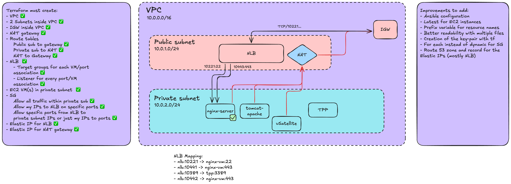
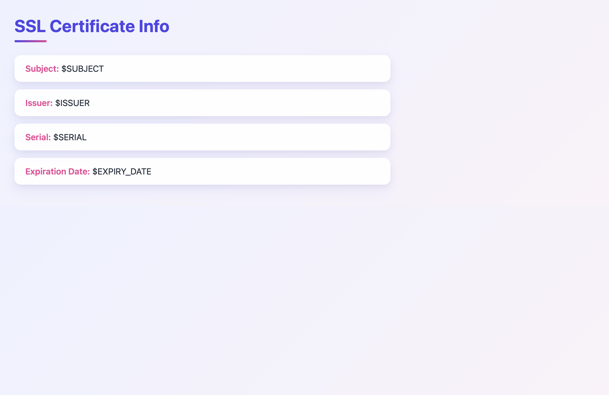

# Cert-Demo-Environment 
The point of this repo is to enable setting up demo environments for PKI solutions easily through IaC. Meaning, Terraform is used to provision the resources and Ansible will be used in the future to configure the resources. The goal is to include as many use cases as possible as time goes on.

# What was done so far
## Terraform 
The AWS provider for Terraform is used to provision the appropriate environment (open to suggestions for architecture/code improvements). Here's the detailed diagram and some notes:



## Script creating the webpage with the certificate information
To maintain a dependance free static HTML page that is as simple as possible, the certificate is fetched on service start/restart. Since the service needs to be restarted when the x.509 certificate is changed, this is not an issue and can be done easily by modifying the service itself.
**Running the script once before modifying the nginx service is the right starting point to test verify permissions etc.**

[The script is very straightforward.](script/update_cert_info.sh)

## Modifying Nginx to actually display this page
Next step is adding a `/cert` endpoint which will actually display the new page with the certificate info.

## Editing the nginx service
The best way to ensure the new static HTML page is created with the new certificate info is to have the script run as a pre-step.
```bash
sudo EDITOR=vim systemctl edit nginx
```
```bash 
[Service]
ExecStartPre=/home/ubuntu/update_cert_info.sh #to replace with the actual path of the script
ExecReloadPre=/home/ubuntu/update_cert_info.sh #to replace with the actual path of the script
```
This can then be tested out with a restart of the service.

## Customizing the webpage's UI
Asking AI for a basic [CSS](web/style.css) to highlight those elements does the trick. Here's the final result:



# Improvements
- Ansible to configure the EC2 instances
- Improvements to the Terraform for AWS
- Terraform to reproduce AWS's environment on other cloud providers (GCP, Scaleway)
- Demonstrating PKI capabilities for Ansible Terraform and Kubernetes workloads
